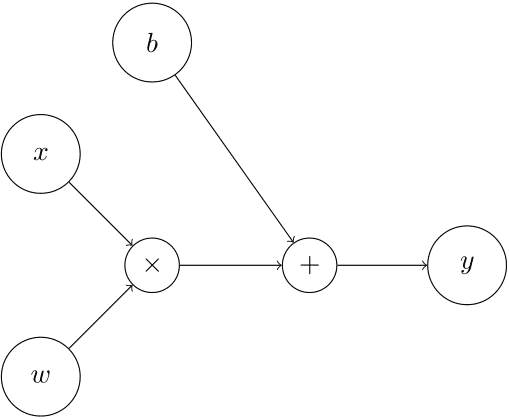
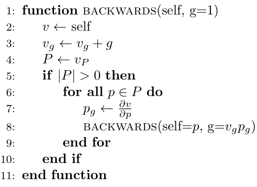
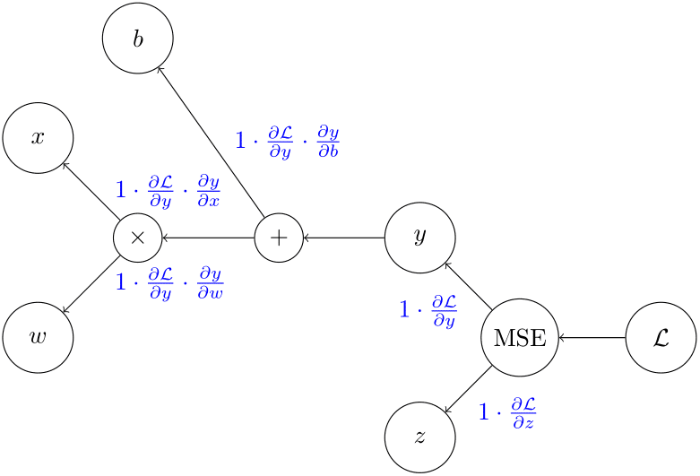

# Scalar Reverse-Mode Autodifferentiation

This package represents a very simple and readible implementation of a dynamic computational graph with reverse-mode auto-differentiation capabilities.

## Implementation

### Dynamic Computational Graph

This project uses the `Node`and operator classes to dynamically build a computational graph $G = (V, E)$ where $V$ is the set of `Node` objects and $E$ is the set of edges.

#### Nodes

Nodes are the objects that represent the vertices of the computational graph. Since this is a scalar engine, all nodes hold scalar values. In this implementation, the graph is bidirectional (not yet developed with cycles in mind):

- It is traversed forwards (i.e., evaluating the expression) via operation overloading; the `Node` class overloads `+, -, *, /`.
- It is traversed backwards as a tree; each `Node` object holds a reference to its parent objects. This is important for gradient backpropagation via the chain rule.

#### Forward Process

A node $v\in V$ is connected to $u\in V$ with some edge $e\in E$ if $v$ is an operand of some operator class (unary or binary) that creates $u$. E.g., given $u = -v$ where $u, v\in V$ then $v$ is a parent of $u$. As such, the graph is built in the forward process, along with the evaluation of the expression. For example, the expression $y = wx + b$ builds a computational graph such that:

#### Backward Process

Given $y = wx + b$, the nodes of the graph $G=\\{x, w, b, y\\}$. Each node $v$ than has its parent set $P_v$. If we call `backward` from $y$ we tell the engine that we want to compute its gradient vector w.r.t. every other (preceding) node in the graph.

$$\nabla y = \left[ \frac{\partial y}{\partial x}, \frac{\partial y}{\partial w}, \frac{\partial y}{\partial b} \right]^\top$$

To acomplish this, the engine makes use of the **chain rule**, where $\frac{d(f(g(x)))}{dx} = \frac{df(g(x))}{dg(x)} \cdot \frac{dg(x)}{dx}$. The engine combines this rule with the computation graph to compute the gradient of the leaf node $y$.

As can be seen from the pseudocode, the `backwards` method performs a depth-first traversal of the computational graph starting from the calling node (hereafter the leaf node). Each node starts with a `gradient` ($v_g$ for the node $v$ in the pseudocode) attribute which is initialized to $0$. This attribute represents the partial derivative of the leaf node w.r.t. the node $v$. As per the pseudocode, this is set to $1$ for the leaf node, and is set to the product of $v_g\frac{\partial v}{\partial p}$ for each parent node of some node $v$. If we follow the recursion and apply the chain rule, then $v_g = \frac{\partial y}{\partial v}$ where $y$ is the leaf node, thus for each parent $p$ of $v$ we have $p_g = v_g\frac{\partial v}{\partial p} = \frac{\partial y}{\partial v}\frac{\partial v}{\partial p} = \frac{\partial y}{\partial p}$.

