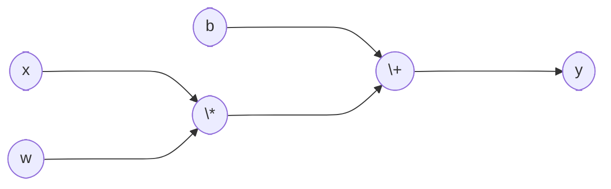

# Scalar Reverse-Mode Autodifferentiation

This package represents a very simple and readible implementation of a dynamic computational graph with reverse-mode auto-differentiation capabilities.

## Implementation

### Dynamic Computational Graph

This project uses the `Node`and operator classes to dynamically build a computational graph $G = (V, E)$ where $V$ is the set of `Node` objects and $E$ is the set of edges.

#### Nodes

Nodes are the objects that represent the vertices of the computational graph. Since this is a scalar engine, all nodes hold scalar values. In this implementation, the graph is bidirectional (not yet developed with cycles in mind):

- It is traversed forwards (i.e., evaluating the expression) via operation overloading; the `Node` class overloads `+, -, *, /`.
- It is traversed backwards as a tree; each `Node` object holds a reference to its parent objects. This is important for gradient backpropagation via the chain rule.

#### Forward Process

A node $v\in V$ is connected to $u\in V$ with some edge $e\in E$ if $v$ is an operand of some operator class (unary or binary) that creates $u$. E.g., given $u = -v$ where $u, v\in V$ then $v$ is a parent of $u$. As such, the graph is built in the forward process, along with the evaluation of the expression. For example, the expression $y = wx + b$ builds a computational graph such that:

